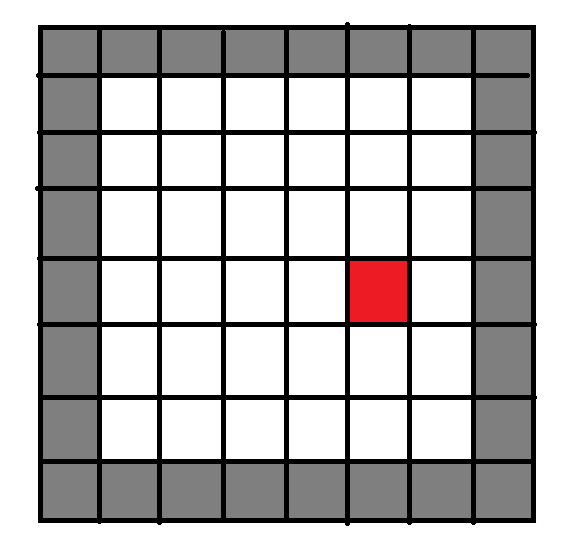
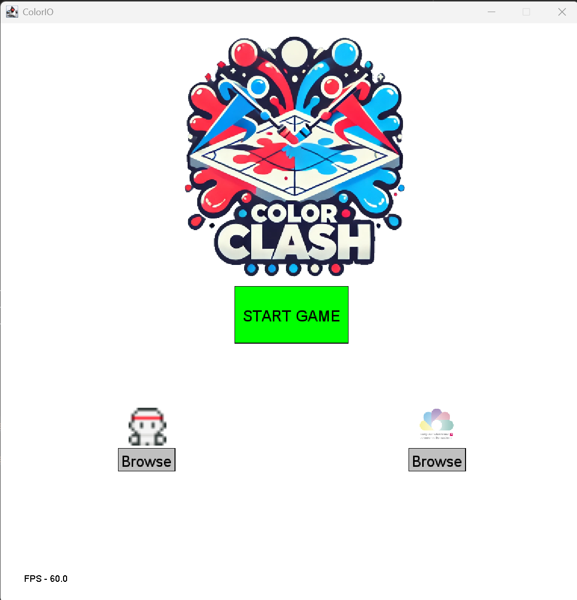
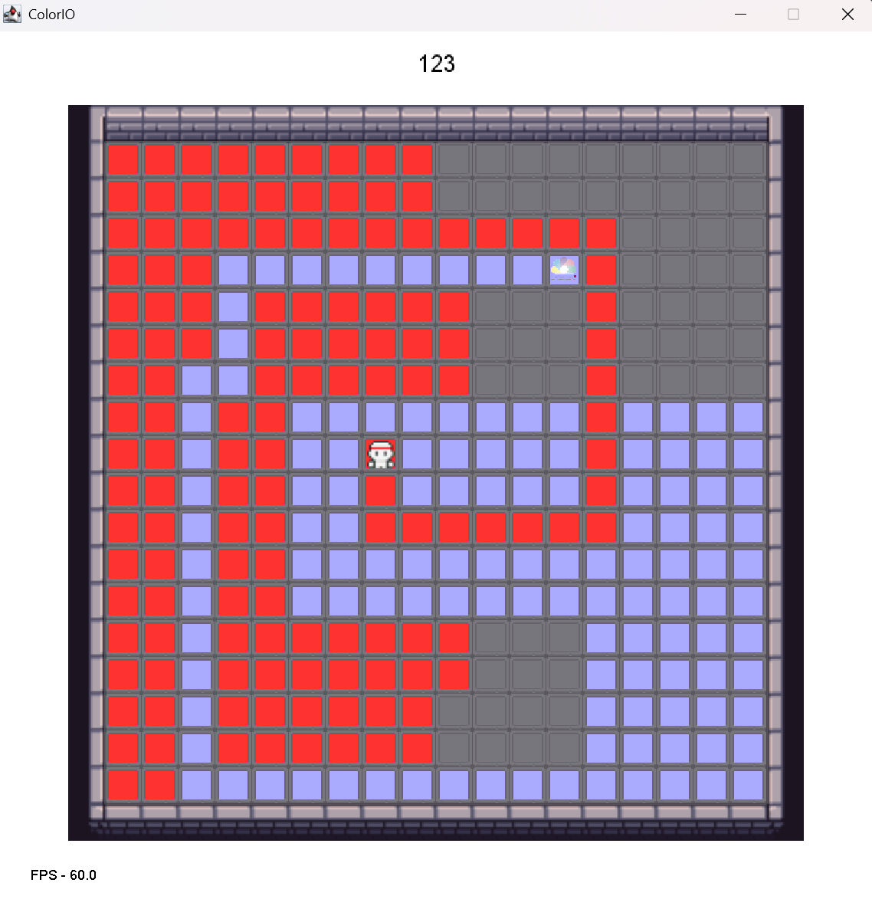
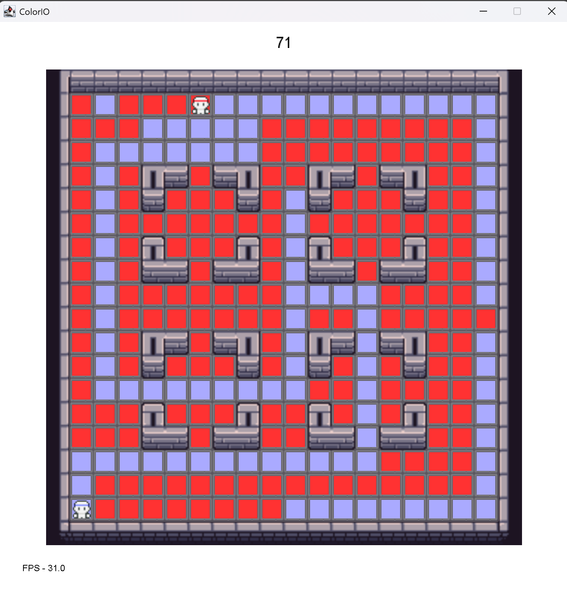
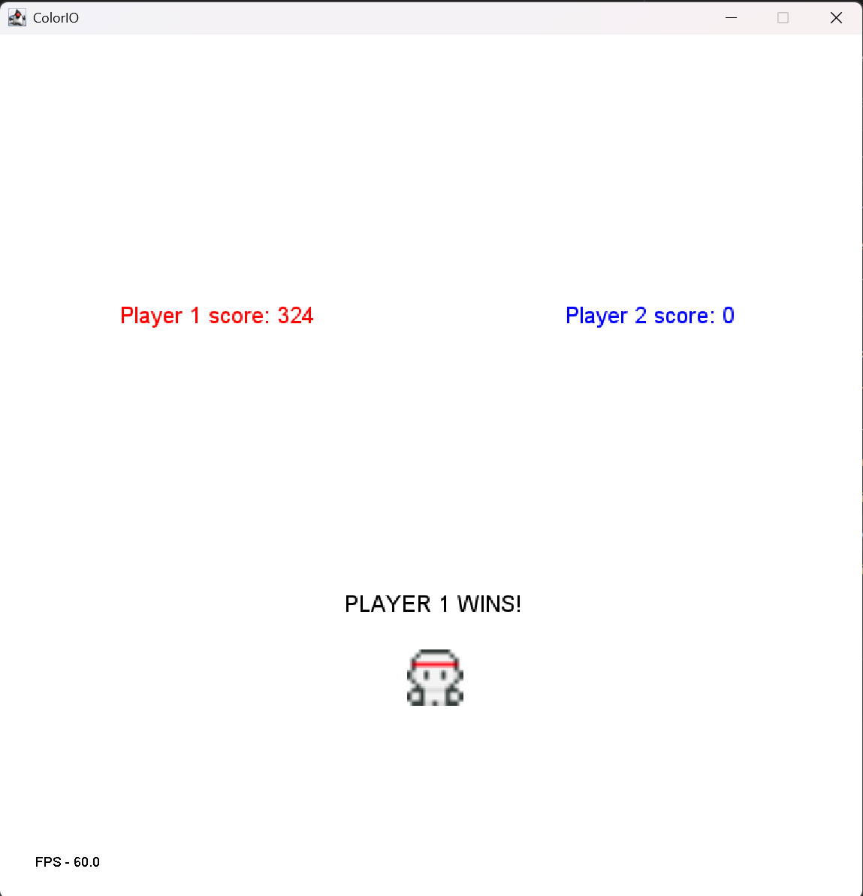
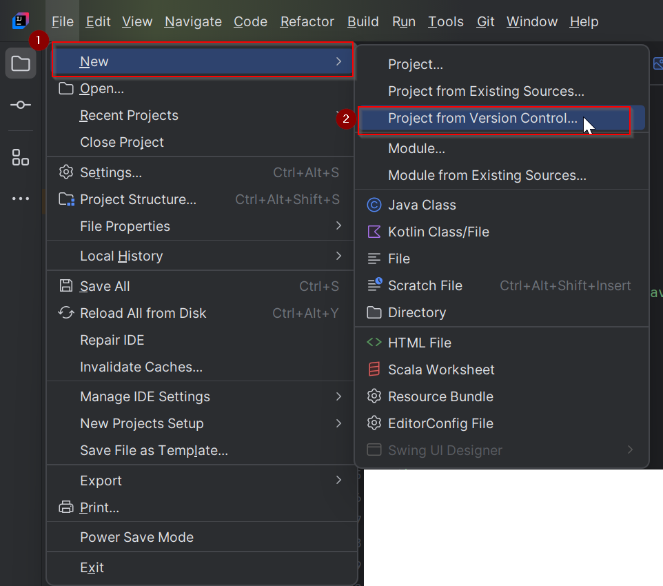
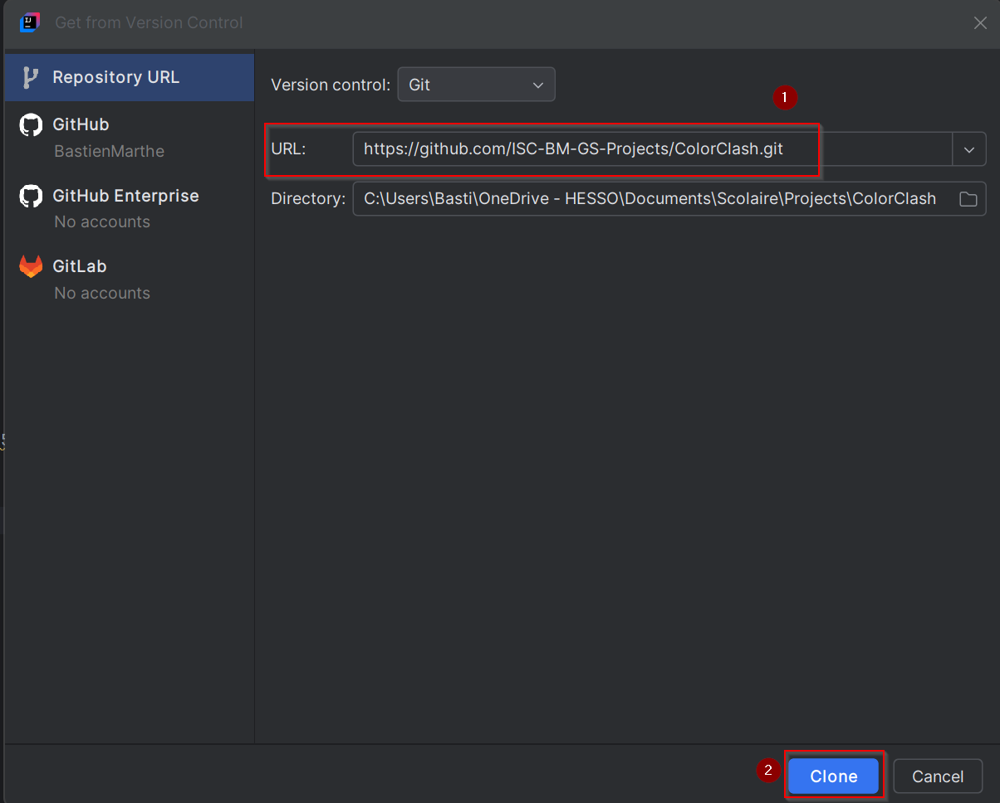

# ColorClash

ColorClash is a competitive 2-player game where each player controls a character moving across a 2D grid, aiming to color as many cells as possible within the given timer.



---

## Concept

The primary objective is to outmaneuver your opponent by covering more cells with your color. Each player starts at opposite ends of the grid and uses their assigned controls to navigate and color cells. The game includes a bonus mechanic where creating rectangles with your color fills the entire area.

---

## Features

- **2-Player Competitive Gameplay:** Strategically move and color cells to outscore your opponent.
- **Rectangular Fill Bonus:** Form a rectangle with your color to automatically fill it with your color.
- **Simple Controls:** Easy-to-learn controls ensure accessibility for players of all skill levels.
- **Timer-Based Challenge:** Players must act quickly to secure the most cells before time runs out.
- **Customize your avatar:** Change your character's image on the main screen.

---

## How to Play

### General Info
- **Objective:** Color as many cells as possible within the time limit.
- **Starting Positions:**
    - Player 1 (Red): Top-left corner.
    - Player 2 (Blue): Bottom-right corner.

### Controls
- **Player 1 (Red):**
    - `W`: Move Up
    - `A`: Move Left
    - `S`: Move Down
    - `D`: Move Right

- **Player 2 (Blue):**
    - `↑`: Move Up
    - `←`: Move Left
    - `↓`: Move Down
    - `→`: Move Right

### Bonus Mechanic
- If a player forms a rectangle using their color, all cells inside the rectangle will automatically fill with their color.
- If a player forms a rectangle using their color around a player, the player inside will be sent back to their starting position.
- If a player manages to color the whole map using their color, he instantly wins.

---

## Screenshots





---

## File Structure

```plaintext
src
├── res
│   ├── level
│   │   ├── ground_v2.png
│   │   ├── wallstone_l1.png
│   │   ├── wallstone_l2.png
│   │   ├── wallstone_l3.png
│   │   └── wallstone_l4.png
│   ├── music
│   │   ├── eat.wav
│   │   ├── music1.wav
│   │   ├── perfect.wav
│   │   ├── supercell-jingle.wav
│   │   └── victory.wav
│   ├── isc-logo.png
│   ├── logo.png
│   ├── Mudry.png
│   ├── player1.png
│   └── player2.png
├── Audio.scala
├── ColorClash.scala
├── Map.scala
├── Play.scala
└── Player.scala
```
---
## Getting Started
1. Launch IntelliJ


2. Clone the repository (https://github.com/ISC-BM-GS-Projects/ColorClash.git)





3. Navigate to the project directory
   ```plaintext
    src
    └── ColorClash.scala
    ```


4. Run the game

---

## Code

The ColorClash.scala file is the main menu.

The Play.scala file is the main method for the game managing the timer, creating the map and player using 
their corresponding classes and using the Audio class to start and stop audio files when necessary.

